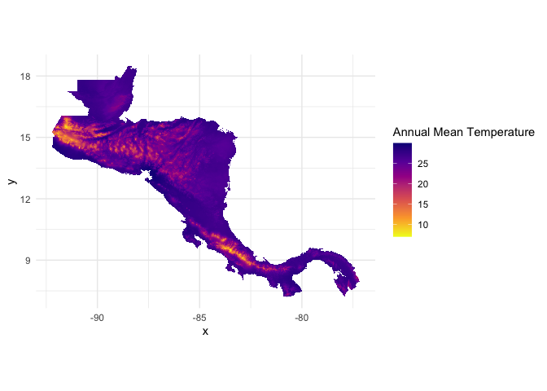

<!-- README.md is generated from README.Rmd. Please edit that file -->

# cacc20812100

<!-- badges: start -->
<!-- badges: end -->

The goal of cacc20812100 is to …

## Installation

You can install the development version of cacc20812100 from
[GitHub](https://github.com/) with:

``` r
# install.packages("devtools")
devtools::install_github("ManuelSpinola/cacc20812100")
```

## Example

This is a basic example which shows you how to use the package:

``` r
## basic example code
library(cacc20812100)
library(tidyverse)
library(sf)
library(stars)
```

``` r
ggplot() +
  geom_stars(data = ca_inm_cm4_8_ssp126_2081_2100[,,,1]) +
  scale_fill_viridis_c(name = "Annual Mean Temperature", option = "C", na.value = "transparent", direction = -1) +
  theme_minimal() +
  coord_equal()
```


